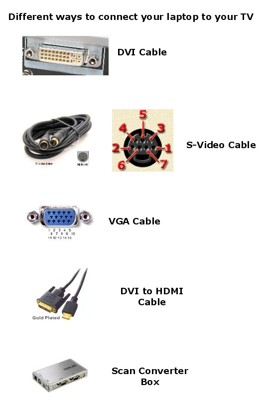

# Connect to TV

## Connect your Laptop/PC/Computer to your TV

1. S-Video – This is probably the most common method out there currently because an S-Video cable is cheap as heck and just about every TV under the sun has a S-Video port. You’ll have to make sure you laptop is equipped with this port. Remember, there are two types of S-Video cables: 4-pin and 7-pin. Most laptops and PC’s are equipped with a 7-pin port, so if your TV only has a 4-pin S-Video port, then this method will not work.

2. VGA – If you have a HDTV, then you will be better off connecting using a VGA cable. It gives much better quality than S-Video and as with S-Video, the cable is very cheap. You usually won’t find a VGA port on regular TV’s though, so this option is if you have an HDTV.

3. DVI - DVI stands for Digital Visual Interface with “digital” being the key word there. The digital signal will give a higher quality picture than either S-Video or VGA. Of course, your computer will need to have a DVI connection and your TV will need to be an HDTV. This cord is definitely not cheap, it ranges anywhere from $40 to $80.

4. HDMI – Using HDMI will give you the best quality by far. No computers that I know of yet have HDMI ports, but you can get a DVI to HDMI cable to connect it to your HDTV. HDMI is compatible with DVI.

5. Scan Converter Box – This is the last method that I could think of and it involves using a scan converter box, which takes a VGA signal and converts it into S-Video or component video.

