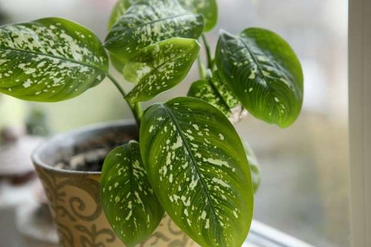

# Gardening Notes

[The Honeybee Conservancy](https://thehoneybeeconservancy.org)
[National Pest Management Association](www.pestworld.org)

## Pests

### Ants

Before you start whacking away at invading ants, figure out where they’re coming from. Look for a trail, or a pattern in their appearance. The best way to control them in the house is to kill them in their nest. If you find the nest outdoors, apply an ant insecticide directly to it. If it’s inside a wall, drill a 1/8-in. hole and squirt an insecticide or boric acid dust into the cavity. If you can’t find the nest, use ant bait. The containers look like tiny flying saucers with holes in the sides. They do work, but you may not think so at first; it can take weeks to kill them all.

Check what your ants are eating. Some brands of bait work for sweet-feeding ants; others (like ant traps) attract protein feeders. If one type of bait doesn’t work, try the other, or put out both at the same time.

#### Erase Ant Trails 

Where you see one ant, you’re bound to see others. That’s because ants leave a scented trail that other ants follow. Sweeping or mopping isn’t enough to eliminate the scent. Instead, mix 1 part vinegar with 3 parts water in a spray bottle, then spray wherever you’ve seen ants in the past. This will stop outdoor nesting ants that entered the house to forage for food (ants that come inside are not necessarily trying to establish a nest).

Vinegar and water won’t stop ants that are already nesting indoors. You’ll need to kill them with ant bait.

#### Determine the Best Ant Bait

When you see an ant, your first impulse is probably to step on it. But don’t. You’ll kill it, but for every ant you see, there may be hundreds more hiding in the house. The ones you see are scout ants, foraging for food to take back to the colony. Use these scouts to wipe out the entire colony.

Prebait ants in areas you’ve previously seen them. Ants’ tastes change during the year. They usually prefer protein in the spring and sweets or fatty/oily foods in the summer. Set out sugar or honey, fried food and peanut butter, then see which food attracts ants. Use whichever food they prefer for bait.

Once you know what the ants like, buy and set out toxic ant bait that’s geared to their taste. Look on the bait package for words like “controls both sweet and grease eating ants.” Stop ants from coming in the house by using this [‘outdoor ant bait (Amazon)’](https://www.amazon.com/dp/B01MSLJTD9/?tag=fhmeag-20) around your yard.

#### Wipe Out Ant Colonies

Once you’ve set out toxic ant bait, expect to see lots of ants (initially). That’s a good thing. It means more ants are taking the bait (which is toxic) back to the colony where they’ll share it with the rest of the ants, including the queen, and kill them. There might be thousands of ants back at the nest.

[Liquid bait](http://www.terro.com/indoor-baiting) is the best way to kill ants for many sweet-loving ants. Other ants prefer solid bait. If you still have ants in house after two weeks, replace the bait containers. If that doesn’t work, how to get rid of ants next means finding the nest.

#### Find Ant Nests

Sometimes the solution to an ant problem is getting rid of their nest. If you’re dealing with carpenter ants, which can do structural damage to your house, it’s vital that you wipe them out ASAP. Finding the nest may not be easy and takes some detective work. Ants generally prefer damp areas, such as framing or flooring that’s soft and spongy from a plumbing or roof leak. How to get rid of ants begins by looking for areas with water damage. Attics, bathrooms and exterior walls are obvious candidates.

Cut small holes in water-damaged walls to track down the ant nest. (You’re going to have to repair the walls anyway.) When you find the nest, spray it with an insecticide that contains bifenthrin, permethrin or deltamethrin (look on the label). [Ortho’s Home Defense Max](https://www.amazon.com/gp/product/B006QYU85Q/?tag=fhmeag-20) is one brand. Be sure to fix the water leak and replace damaged wood. If you can’t track down the nest, hire a pest control service. 

#### Spray Ant Entry Points

After ridding the house of ants, take steps to ensure they don’t come back. Caulk and seal holes, and then spray insecticide around doors and windows. An insecticide that contains bifenthrin, permethrin or deltamethrin is one way how to get rid of ants. Spray a 4-in.-wide band along entry points, just enough to wet the surface.

Once dry, the spray leaves an invisible film that repels ants so they won’t enter the house. Each spring, spray the insecticide to guard against ants. But keep in mind that this only works to keep ants out—it won’t kill ants that are already inside, and it can actually interfere with the use of ant baits. Kill more than just ants with this [multipurpose insect bait (Amazon)](https://www.amazon.com/dp/B0067GZUVK/?tag=fhmeag-20).

#### Spray on an Ant Barrier

If you’re still getting ants in your house after spraying interior entry points, spray a 12-in.-wide band of insecticide on the foundation and on and under the first course of lap siding to keep ants from entering the house. An outdoor insecticide that says “barrier treatment” on the label is one tool for how to get rid of ants.

#### Destroy Exterior Ant Nests

If you frequently see ants in the same area on the siding, there’s probably a nest in there. How to get rid of ants begin with looking for holes in the siding where ants are crawling in and out. The holes are often located between bricks where mortar has fallen out, under lap siding or in cracks in stucco. Once you locate the nest, or the vicinity of the nest, spray the area with an insecticide containing bifenthrin.

#### Kill Ants in Your Yard

Anthills are eyesores in yards, and the ants can ruin outside dining. If you only have ants in a certain area, like along your sidewalk, spot-treat the area with an outdoor insecticide. Liquid or granules work fine as a way to get rid of ants.

For large-scale ant problems on how to get rid of ants, use a lawn and garden insect killer that contains bifenthrin as the active ingredient. The spray will also kill other insects (read the label for a list).

	1. First, mow the grass.
	2. Then spray the insecticide on the entire lawn—you can also spray shrubs and trees.

Spray in the early morning or late afternoon when the ants are most active. And it’s best to spray on a calm day to prevent drift. If ants are still building mounds after six weeks, treat the lawn again (the insecticide works for up to six weeks). You won’t kill every ant in your yard (nor would you want to!), but spraying will eliminate most of them and stop the annoying mounds. Keep those pests away with these natural remedies.

#### Eliminate Safe Havens for Ants

Once you kill the ants in your house and yard, take steps to ensure they don’t come back.

	· Trim back bushes, shrubs and trees that brush against your siding or roof that provide a bridge for ants to reach your house. [Remove these pests and find out how they gained entry to stop future incursions](https://www.familyhandyman.com/pest-control/11-strategies-for-do-it-yourself-pest-control/).
	· Keep a 3-in. to 6-in. clearance space between the soil around the foundation and the bottom row of siding to prevent ants from nesting in the siding (and make sure the soil slopes away from the house).
	· Avoid stacking firewood next to the house. Firewood makes a perfect retreat for ants.
	· Ants like bare spots in the yard and they like to build nests under layers of thatch. Maintaining a healthy lawn is one way to get rid of ants.
	· If anthills pop up in bare areas, spray the mound with insecticide and plant grass in the bare spots in order to get rid of ants.
	· Rake the lawn or bag the grass when you mow to eliminate thatch.

CAUTION!

	· Don’t use bait or traps where kids or pets can get at them.
	· Federal law requires insecticides to be labeled with at least one of three words: Danger, Warning or Caution. Try to avoid using products labeled with the word “Danger.”
	· In general, avoid insecticides that are effective only if sprayed over a wide area. They provide minimal contact for bugs and maximum contact for people.

If you use an insecticide indoors, make sure it’s explicitly labeled for indoor use.

### Bees

#### Carpenter Bees

Don’t worry. They’re mostly harmless. Carpenter bees are huge—like a bumblebee—and they look ferocious, and they can be very defensive about their territory. But they rarely sting, and even though their tunnel-like nests inside deck wood and under eaves look destructive, the nests are usually small, and control is easy. After dark, squirt an insecticide, labeled for carpenter bees, in the entrance hole and caulk it closed a few days later. 
 
### Mice & Mole Control

#### Inside Poison: (Not safe for pets!!!)

	· Dry cement powder
	· Cornflour

Directions: Mix 50/50 and place in a shallow dish or station in the path used by rodents (can be used for inside control). After feeding the mouse will seek water outside which causes the cement powder to react, quickly killing it. Source: [ahc.sa.gov.au](http://www.ahc.sa.gov.au/page.aspx?u=606).

#### Repellent for Outdoors

Peppermint oil is an effective mouse deterrent.

For Moles & Mice:

	· 2 TBS Castor oil
	· 6 TBS liquid dish washing soap
	· 1 tsp Tabasco
	· 1 minced garlic clove
	· 1 quart water

Directions: Mix a fresh batch before use, pour around the rodent hole. Reapply after each rain. Source: Natural Alternatives for You and Your Home by Casey Kellar.

For Moles & Mice #2

	· 1/2 cup liquid detergent
	· 1 TBS Tabasco sauce
	· 1 gallon of water

Directions: Mix and spray around rodent holes and in areas where they’ve been spotted. Apply after each rain.
Plant repellents: Peppermint, sage. Plant these in your garden and in flower beds along the house if you routinely have a problem.

## Poisonous Plants

#### Daffodil

If you seek help quickly, ingesting daffodils won’t kill you. However, according to the [NCPC](https://www.poison.org/articles/2015-mar/daffodils), ingestion can be fatal to small children and pets if left untreated. And while all parts of a daffodil contain the toxic chemical lycorine, it’s the oxalates—or toxic chemicals found in the plant’s bulb—that do the most damage to your body. If you experience throat pain, difficulty swallowing, and severe drooling that persists for several hours, get thee to a doctor, stat.

#### Dieffenbachia

When it comes to dieffenbachia, it’s small children and [pets](https://bestlifeonline.com/pet-health-benefits/?utm_source=msn&utm_medium=feed&utm_campaign=msn-feed) that you should be concerned about. Why? Well, both your animals and your youngsters can’t differentiate a dangerous backyard plant from a snack, and they are therefore the most likely to take a big bite out of a dieffenbachia leaf. If your pet or small child does ingest a dieffenbachia leaf containing insoluble calcium oxalate crystals, they will experience excessive drooling, oral pain, vomiting, and a decreased appetite.

#### Foxglove

The foxglove plant produces digoxin, an active ingredient in medications that prevent heart failure. According to the [NCPC](https://www.poison.org/articles/2015-mar/foxglove), by ingesting foxglove, you’re essentially “taking an unregulated dose of heart medicine,” which can, ironically, cause [heart failure](https://bestlifeonline.com/heart-risk-factors-after-40/?utm_source=msn&utm_medium=feed&utm_campaign=msn-feed). As such, you should keep this plant far, far away from children and animals. 

#### Hydrangea

As far as the poisonous nature of the popular hydrangea plant is concerned, only the flower buds are truly harmful when ingested, according to the [Canadian Biodiversity Information Facility](http://www.cbif.gc.ca/eng/species-bank/canadian-poisonous-plants-information-system/all-plants-scientific-name/hydrangea-macrophylla/?id=1370403266887). If consumed, humans can experience an upset stomach, skin irritation, and, in more serious cases, convulsions and coma.

#### Rhododendron

The honey produced (and sometimes eaten) from the common rhododendron plant is also called “mad honey”—and for good reason. According to the [NCPC](https://www.poison.org/articles/2015-mar/azaleas-and-rhododendrons), the toxins found in the plant cause confusion in those who ingest it, along with dangerously low blood pressure and sometimes even death. ([Fun fact](https://bestlifeonline.com/feel-good-facts/?utm_source=msn&utm_medium=feed&utm_campaign=msn-feed): The earliest case of rhododendron poisoning is said to have occurred in the first century B.C.E. when Roman troops were allegedly poisoned with its honey. The day after they were poisoned, they were so confused that they lost a battle.)

#### Tulips

Tulips might make your garden shine, but they also have the potential to poison your pet. According to the ASPCA, this plant is toxic to dogs, cats, and horses in its bulb especially, and symptoms of ingestion range from vomiting and diarrhea to hypersalivation and depression.

#### Wisteria

When it comes to dangerous plants in your backyard, wisteria is one of the worst ones there is. According to one case study from the [Santa Clara Valley Medical Center](https://www.ncbi.nlm.nih.gov/pubmed/8433406), the wisteria plant can cause [headaches](https://bestlifeonline.com/headache/?utm_source=msn&utm_medium=feed&utm_campaign=msn-feed), gastroenteritis, hematemesis, dizziness, confusion, diaphoresis, and, frighteningly, syncopal episodes (or temporary drops in blood flow to the brain that result in a loss of consciousness and control of the muscles). 

