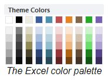

# Excel Notes

  

Microsoft  
  [Table References](https://support.microsoft.com/en-us/office/using-structured-references-with-excel-tables-f5ed2452-2337-4f71-bed3-c8ae6d2b276e?ui=en-us&rs=en-us&ad=us)  
[Vertex42](https://www.vertex42.com/) - numerous Templates

#### Common Folders
```dos
C:\Users\<UserName>\AppData\Roaming\Microsoft\Templates\Document Themes\Theme Colors
```

## Using Color Themes  
[Color Template Generator](https://www.vertex42.com/ExcelArticles/color-palette-generator.html)  
- [GDBlueTheme.xml](GDBlueTheme.xml)  
[Theme Enabled Excel Templates](https://www.vertex42.com/ExcelArticles/theme-enabled-templates.html)  

### Create Your Custom Color Palette
1. Choose a color for Accent 1 that may be based on your brand or just something you think will look great. You can enter the RGB value using RGB(0, 150, 255), the HTML hexidecimal value (such as #557799).  
2. Adjust the Saturation and Luminosity to your liking, using the sample graph and budget table to get an idea how the colors will work together.  
3. Adjust the Hues of each of the separate Accent colors to your liking. Currently, the color scheme uses Analogous and Complimentary Colors.  
4. Download the XML file and store the color theme file in the special "Theme Colors" folder that Excel users to load all custom theme colors (see below).  

**Note**: Typically, the Hue of a color ranges from 1-360 degrees (because it is usually represented in a color wheel), but Excel uses the range 0-255 if you are entering the colors manually using the HSL values.  

### Use the XML File

Excel stores your Color Theme files as separate XML documents inside the program's user settings on your computer. If you need help finding this location, see [Customize how Excel Starts}(https://support.office.com/en-us/article/customize-how-excel-starts-6509b9af-2cc8-4fb6-9ef5-cf5f1d292c19) at support.office.com. The location of the folder that contains the XML files for Theme Colors may look like this:  
```dos
C:\Users\username\AppData\Roaming\Microsoft\Templates\Document Themes\Theme Colors  
```
The color theme that you use for a workbook in Excel is saved with that workbook. This means that you can save the current color theme in your workbook as a named color theme and use that theme in other workbooks.  

After saving the XML file in this location, when you open Excel, you'll be able to find this color theme listed as an option under `Page Layout > Themes > Colors`.  

### Use Theme Colors from Another Workbook  

If you like a set of theme colors from another workbook, you can save and name that set of theme colors so that you can select it in other workbooks. Take a look at our Yearly Calendar page for examples of various color schemes.  

To save theme colors for use in another workbook (Excel 2010+):  

1. Open the .XLSX workbook that contains the color scheme you really like.  
2. Go to **Page Layout** and select **Colors** in the **Themes** button group.  
3. Click on **Create New Theme Colors** (or **Customize Colors**)  
4. Name the color scheme whatever you want in the **Name** field, then click **Save**.  

After you do this, you will see your named set of theme colors as an option in the `Page Layout > Colors` drop down box. If you want to edit your color set later, find it in the list and right-click on it.  

Note: Your custom themes are saved as xml files on your computer in the Application Data folder so if you switch computers you won't see your custom themes listed. Theme colors used in a .xlsx workbook are saved as xml data within the workbook file.  

## Change a table name?  
When you create an Excel table, Excel creates a default table name (Table1, Table2, and so on), but you can change the table name to make it more meaningful.  
1. Select any cell in the table to show the `Table Tools > Design` tab on the ribbon.  
2. Type the name you want in the **Table Name** box, and press **Enter**.    

### Use the following rules for table names:  
1. **Use valid characters**  Always start a name with a letter, an underscore character (_), or a backslash (\). Use letters, numbers, periods, and underscore characters for the rest of the name. You can’t use "C", "c", "R", or "r" for the name, because they’re already designated as a shortcut for selecting the column or row for the active cell when you enter them in the **Name** or **Go To** box.  
2. **Don’t use cell references**  Names can’t be the same as a cell reference, such as Z$100 or R1C1.  
3. **Don’t use a space to separate words**  Spaces can’t be used in the name. You can use the underscore character (_) and period (.) as word separators. For example, DeptSales, Sales_Tax or First.Quarter.  
4. **Use no more than 255 characters** A table name can have up to 255 characters.  
5. **Use unique table names** Duplicate names aren’t allowed. Excel doesn’t distinguish between upper and lowercase characters in names so if you enter “Sales” but already have another name called “SALES" in the same workbook, you’ll be prompted to choose a unique name.  
6. **Use an object identifier**  If you plan on having a mix of tables, PivotTables and charts, it's a good idea to prefix your names with the object type. For example: tbl_Sales for a sales table, pt_Sales for a sales PivotTable, and chrt_Sales for a sales chart, or ptchrt_Sales for a sales PivotChart. This keeps all of your names in an ordered list in the Name Manager.  

