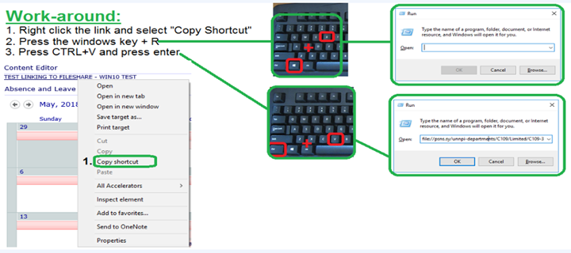

# SharePoint

#### Videos & Training

AIIM – A non‐profit organization of IT Professionals

	○ http://www.aiim.org/sharepoint/  

Microsoft

	· http://technet.microsoft.com/en‐us/library/ee428287.aspx
	· http://msdn.microsoft.com/enus/library/dd776256(v=office.12).aspx
	· http://blogs.msdn.com/b/ecm/
	· https://www.microsoft.com/en-us/learning/sharepoint-training.aspx

Others

	- http://www.sharepoint‐videos.com/

## A Brief Overview of the SharePoint Site
 
### Navigation
 
	• The main top menu is used through out many of the sites. You will notice that Departments have a modified version of the main top menu. These menus will at a minimum have the SP Home, Departments, and ITKB tabs from the main menu.
	• Left Menu – Customized per site.
	• Bread Crumbs – Toward the top of the screen, just below the top menu you will see some links that show you the navigation to this page you are on (ie: PSNS&IMF SharePoint > Tools). These links are helpful to return to the main pages of the site.
	• Main Content Area – You will see what are called Web Parts in this area. You can click on the Title of the Web Part (ie Announcements) to display the list or you can click on an item in the Web Part to display a specific item. It is important to know that many times the information shown on the home page left area are a limited view of the information. To view more items in the list, open the list.
 
### Finding Information
 
	• Search: Search at top right, you can select, All Sites, This Site, This List (if you are looking at a list).
	• Sorting: When you have a list open, you can click on the heading titles to sort ascending. An additional click will sort it to descending. (Not all columns have this functionality.)
	• Filtering: When you hover over a heading title in a list, you will also see a menu pop up with an arrow. If you click on this you will see options to sort or filter on an item in the list. This filtering is similar to what you may be familiar with in Excel. (Not all columns have this functionality.)
	• Views: You can create views of the list to assist in finding information. Views are used in SharePoint to replace reports in many cases. 

### List Types
	 
SharePoint is really a collection of lists. Some lists store documents, some store tasks, some store appointments. Some lists have special functionality associated with them. Here is some of the lists that you may use the most.
	 
	Announcements: Gets news and information out to users.
	Calendars: Displays information visually by date.
	Contacts: Stores lists of people.
	Custom Lists: When the other lists are not appropriate.
	Discussion Board: Forum style discussions.
	Document Library: Stores Word, Excel, etc.
	Links: Displays links web pages.
	Picture Library: Stores images.*
	Tasks: Tracking of issues or jobs.
	Wiki Page Library: Stores short topics.

### Typical List Functions
 
Most lists have similar functionality:
 
  § Create a new list item: Click on the New button. If you click on the down arrow, you will sometimes see the ability to create different types of items.
 
  § View the list item menu: Hover over the item title, click on the down arrow to open the menu and see options. Some of these options are also available when you are editing an item.
 
  § Read a list Item: Click on the link. When open, if you have rights to the lists, you will see options to edit or delete.
 
  § Assignment fields: Allow you to assign tasks to people or SharePoint Groups.
 
  § Creating Views: You can create views of the list to assist in finding information. Views are used in SharePoint to replace reports in many cases. Use the SharePoint help to find information on how to create a View. Press the   image in the upper-right of your screen. Search for “Create a View”. The views that you create are Personal Views that are displayed only to you. The list manager can create views that need to be available to all users.
 
  § Multiple line editing fields: If you have rights to edit an item, you may see where some multiple line fields allow you to format text. Do not use underlines. Underlines are reserved for links. You can use italics, bold, colors, and font size to bring attention to specific text. (Do not overuse these or your document may be hard to read.) Please do not type in ALL CAPS. This is also hard to read if overused.
	 
	 
*Picture Library: It is important to ensure that the source of each image is identified. Some sites state that the images are “free” but you must view all the copy write information to ensure that business and/or government are not excluded.

### Document Library Additional Functions
	 
Document Libraries have additional functionality
 
#### Display the document: 
 
  Just click on the document link. 
 
#### Edit a document
 
  Hover over the title area, click on the down arrow to open the menu. Select “Edit in Word” (Excel, etc). Note: If you simply click on the document and then edit it, problems can occur. You can have conflict with another person that is trying to edit the document. It is always best to use the menu to let SharePoint know that you intend to edit the document. That way, other users that also try to edit the document will be notified that it is already open for edit.
 
#### Edit the properties of a document
 
  This is also referred to as Meta Data. This is the information shown on the list for a document library. From the list, hover over the title area, click on the down arrow to open the menu. Select “Edit Properties”

#### 	Upload a document
	 
  From the list, click on the Upload button. You will see options to upload a single document or multiple. Important note for uploading multiple documents: If your list has mandatory fields, the items will upload, but they will be checked out to you. No one will be able to see the items until you edit the properties on each item and check each one in. If there are mandatory fields in your document library, your POC can add the “Checked Out” column to a view, or you can create a personal view. Items that are checked out also have a slightly different icon. It is the same as others of that type in your library except for the addition of a little green arrow at the bottom.
      
#### Explorer View
   
  § Can copy and paste documents from one library to another. Don’t forget to delete the other copy. If you truly need to have the same document in more than one SharePoint Library, see the section on Sending Documents from one Library to another.
  § Copies the Meta Data when it can. If you are copying to another list you need to validate the item properties. (Sometimes they do not come across or will be incorrect if either list is getting column info from a separate list.)
   
#### Document Check-out
   
  This can be optional or mandatory for a document list.
   
  Note that if you have a document checked out, you are the only one that can see your changes. 
   
  On lists that it is mandatory to check out a document prior to editing it, the Check out column should be shown on the list. This will help others know that the document is currently getting revised. It will also help the person editing the document remember to check it back in when they are finished.
     
  Also see the “Upload a document” section above for issues with mandatory fields causing an automatic checkout when uploading multiple documents. 

### 	Version Control
	 
Use version control only when necessary. It can eat up space on the server.
 
It can be set up many different ways. All versions can be kept or only a specific number.
 
Minor Versions: The information will still not be available for others to see, but it allows you to save a copy that you can revert to if you make a mistake.
 
Major Versions: Publishes the document so that all can see it.

## SharePoint Interaction with Microsoft Office
 
SharePoint is designed to work with Microsoft Office.

**Excel**
   
  When you Export to Excel, it is important to know that your Excel Spreadsheet may be still tied to the SharePoint list.
   
**Outlook**
 
  If you need to share a document that is stored in SharePoint, it is best to send the user a link rather than sending the user the document.
   
      § If the item is a document library, go to the list and right click on the link to the document. Select Copy Shortcut. Paste this in your email.
      § Note that there is an interesting tip on how to send a person a link to a list that you have already filtered and sorted. 
 
  If the person does not have access to the list that the document is in, you may need to send the file to them instead.
   
      § When you are in the find attachment window in outlook, just paste the same URL information into the File Name field.
	 
You can view and modify SharePoint calendars in Outlook.

## Helpful Tips

Modifying your settings in SharePoint

  To modify your User Information, Regional Settings, and Alerts:
    § Click on “Welcome (your name)” at the top right of the page.
    § Select: My Settings

Getting Help in SharePoint

    § Use the SharePoint Help. Press the   image in the upper-right of your screen. Search for a word or phrase. 
    § Use the IT KB tab at the top of the page. After you click on “Knowledge Base” to open the list, there is a view that will show only SharePoint Items. Use filters, sorting, and the search capability to find information here.

Basic Guidelines for content formatting

    § Do not use ALL CAPS – it is hard to read and often similar to SHOUTING.    
    § Do not use underscore or the blue link color unless it is a link.
    § Use bold, italics, and other colors only where needed to draw attention. If overused, they lose their importance.
    
Use a similar font and font-sizes throughout your documents. 

## Check out a document in a SharePoint workspace

	1. Click the Document Library that you want in the Content Pane of the workspace.
	2. Select one or more documents to check out.
	3. On the Home tab, in the SharePoint group, click Check Out.
 
## Create a SharePoint workspace

Do one of the following to take your work offline:
	· In a web browser, go the site you want to synchronize to a SharePoint workspace. Click Site Actions, click Sync to SharePoint Workspace.
	· In the SharePoint Workspace launch bar, on the Home tab, click New, click SharePoint Workspace, select a SharePoint site from the list or enter a SharePoint site URL, and then click OK.

## Lists in SharePoint  

	Connect a list in a SharePoint workspace to the server
		a. Select the list in the Content pane. It will be listed under Available on Server.
		b. Click Connect <list name> to Server.
If this option is not available, the list does not support synchronization to a SharePoint workspace.
	Change how lists are sorted in the content pane
	Do one of the following:
		a. On the View tab, in the Sort group, click the Content menu and select an option.
		b. Right-click in the title bar of the Content pane, click View Tools By, and then click the option you want.
	Disconnect a list in a SharePoint workspace from the server
		a. In the Content pane, click the list that you want to disconnect from the server.
		b. On the Sync tab, click Change Sync Settings, and then click Disconnect <list name> from Server.
	Manually synchronize a list or workspace with the server
		a. If you only want to synchronize a specific list, select the list in the Content pane of the workspace.
		b. On the Sync tab, click Sync, and then click Sync Tool.
Click Sync Workspace to synchronize all lists in the workspace with the server.

## Resolve a conflict or error

	1. Select the item that indicates a conflict or error.
	2. On the Error Tools/Resolve tab, click Resolve Conflict or Error.
	3. Do one of the following, depending on the type of item:
	4. If the item is a document, select Resolve options in the Upload Center.
	5. If the item is a List item, select an option in the Resolve Conflict dialog box.

## Unable to Load Page Error

NMCI Windows 10 users are unable to access SharePoint documents such as Nuclear Power Manuals/IPI, from the PSNS&IMF Homeport. This is a known issue with Internet Explorer and linked files from Sharepoint. Troubleshooting is in progress. Until this issue is resolved, please follow the below instructions (instructions with images attached).
	1. Right click on the link and select "Copy Shortcut"
	2. Press the windows key + R
	3. Press CTRL+V and press enter

## SharePoint Editions

Now that you have a broad vision for what SharePoint can do in a nonprofit or library setting, it's time to understand the differences between each edition.

The main editions are the free, standard, and enterprise editions.

	• Free versions. Each generation of SharePoint includes a free, bare-bones version. This free version gives you access to basic collaboration and content-management features, but if you want all the bells and whistles, you'll need the standard or enterprise edition. In the latest release, the free version is called SharePoint Foundation 2010.
	• Standard editions. This includes the core feature sets, such as content management, document management, collaboration, and enterprise search. The most recent release is SharePoint Server 2010 Standard Edition.
	• Enterprise editions. This includes all the features of the standard editions, but the enterprise edition also contains Business Intelligence (BI) features, support for integrating and streamlining business processes, and other features. The most recent release is SharePoint Server 2010 Enterprise Edition.

For more information, see TechSoup's [Guide to SharePoint Server Editions and Licensing](http://www.techsoup.org/support/articles-and-how-tos/guide-to-sharepoint-server-editions-and-licensing) and Microsoft's detailed [comparison of features](http://sharepoint.microsoft.com/en-us/buy/Editions-Comparison).

# SharePoint for Non-Profits
How can nonprofits and libraries manage large amounts of data across multiple systems, and still provide external users with a seamless, integrated experience? Microsoft SharePoint offers a collection of tools that can help your organization do just that. Learn what SharePoint can do for your nonprofit or library.
 
### What Is SharePoint?  

Often described as a content management system and a collaboration suite, SharePoint could also be called an integrated knowledge-management platform. SharePoint includes features that help organizations:

	• Collaborate more seamlessly online
	• Manage processes
	• Search for data
	• Manage and share documents
	• Access stored information
	• Create and manage wikis and blogs
	• Host websites (certain editions)

Organizations can also use SharePoint as a foundation for creating customized solutions that meet their unique collaboration and communication needs. These customizations might include enabling or disabling out-of-the-box features; plugging in free software extensions created by Microsoft and third-party developers; and even developing new SharePoint extensions.

## How Nonprofits and Libraries Can Use SharePoint

Here are just a few ways that SharePoint could help a nonprofit or library:

	• More secure information management — SharePoint's governance, workflow, security, document permissions, and records-retention features allow administrators to automate procedures and track data efficiently across multiple information systems. This helps reduce the threat of legal, public-relations, and funding repercussions due to data loss or security breaches.
	• Better collaboration — A shared repository of documents and other information helps improve collaboration and reduces duplication of effort
	• Finding information faster — When systems aren't integrated on the back end, it's impossible to do a single search across all of an organization's data repositories. Users have to open multiple search interfaces and use different keywords to find all available information on a particular topic. SharePoint integrates these separate data repositories, allowing you to perform keyword searches from a single interface and retrieve consistent, comprehensive results from across the entire organization.
	• Improving organizational memory — SharePoint helps centralize and organize old documents and records. Staff members can more easily learn from experience and make good strategic decisions when they can find past emails and reports.

## New and Improved Features in SharePoint 2010
Let's look at what's new in SharePoint 2010:

### Expanded Browser Support
With previous versions of SharePoint, users had to update their SharePoint sites using Internet Explorer or SharePoint-compatible applications such as Microsoft Office or SharePoint Designer. Now you have more options when it comes to web browsers: SharePoint 2010 supports recent versions of Internet Explorer, Firefox, and Safari.

### Support for Mobile Devices

Office Mobile includes SharePoint Workspace Mobile. This allows users to edit Office documents and then save them back to their organization's SharePoint site using a mobile device. Office Mobile comes bundled free with recent Windows phones.

### Bringing Social Networking into the Enterprise

SharePoint 2010 approaches social networking as a vehicle for organizational collaboration and productivity. For example, SharePoint lets anyone in the organization add tags and notes to any page on the intranet, turning the entire internal website into a collaboration tool. SharePoint 2010 also provides the ability to set up tools such as blogs, wikis, and RSS feeds.

New social networking features in SharePoint 2010 include an improved user profile page, a dynamic activity feed, a central picture library, and knowledge mining.

### Improved Findability

[Findability](http://en.wikipedia.org/wiki/Findability) is a term coined by information architect and usability expert Peter Morville to describe how easy it is for users to locate and access information resources on a website or other information-management system.

With SharePoint 2010, Microsoft has substantially improved findability, especially in metadata and enterprise search:

	• Metadata, Classification, and Tagging — SharePoint 2010 offers organizations several options for classifying and categorizing their content. You can opt for a [controlled, centralized approach](http://www.cmswire.com/cms/document-management/sharepoint-2010-using-taxonomy-controlled-vocabulary-for-content-enrichment-007286.php) to taxonomies and classification, in which managers and systems administrators centrally create and manage lists of available terms and keywords. Or, SharePoint also supports using a decentralized [folksonomic tagging system](http://www.cmswire.com/cms/document-management/sharepoint-2010-using-social-features-for-personal-classification-improved-findability--007350.php). In a folksonomic system, users can add their own keywords to documents by simply tagging them as they see fit, which doesn't require help or permission from IT. SharePoint 2010 also allows you to combine both approaches.
	• Enterprise Search — SharePoint 2010 improves upon the enterprise search capabilities in the 2007 version by adding:
		○ Boolean search. Searchers can use AND, OR, NOT, +, or – to narrow in on the most relevant search results.
		○ Wildcard search. Searchers can get a wider set of results by adding a wildcard operator (*) in place of certain words or letters.
		○ Faceted search. Once users submit a search query in SharePoint 2010, they receive a refinement panel along with their search results. They can hone in on their desired results by selecting their preferred results type, author, tag, or modified date.
		○ People search. The search engine in SharePoint 2010 indexes employee profile directories, not just document repositories. Search results, therefore, return not only documents but also links to individuals with the desired expertise.

## Installation Support for Nonprofits and Libraries

SharePoint is advanced software that provides many information-management features. You will need to invest time up-front to understand which features suit your organization's needs, just as you would if you were planning a new website or setting up a new donor management system.

You may also want to consult with a professional to help design and implement your organization's SharePoint solution. TechSoup Special Programs donor partner [mindSHIFT Technologies](http://www.mindshift.com/) offers eligible organizations [a four-hour intranet assessment donation](http://www.techsoup.org/products/--G-44011--). Eligible organizations will receive four hours of phone consultation, followed by a written assessment on whether SharePoint is a suitable platform for their library or nonprofit, along with suggestions for ensuring a [successful implementation](http://forums.techsoup.org/cs/community/b/tsblog/archive/2010/06/21/sharepoint-server-2010-learning-resources.aspx).

Learn more about this and other SharePoint Server 2010 learning resources from this companion blog post.

