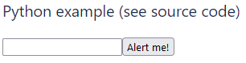

# Web Development with Browser Python (Brython)


### Load Brython JS
```html
<!-- Load Brython JS Libraries -->
<script type="text/javascript" src=" brython.js"></script>
<script type="text/javascript" src=" brython_stdlib.js"></script>
```

### Run Brython on load
```html
<script>
  AJS.toInit(function() {
    brython();
  });
</script>
```

## Python in a Browser Example

```python
<script type="text/python">
from browser import document, alert

def echo(event):
  alert(document["zone"].value)

document["mybutton"].bind("click", echo)
</script>
<br>
<input id="zone"><button id="mybutton" class="marked">Alert me!</button>
```

## Open a Python interpreter
```html
<script type="text/python">
from interpreter import Interpreter
from browser import document

def OpenInt(event):
	Interpreter()

document["InterpreterButton"].bind("click", OpenInt)
</script>
<br>
<button id="InterpreterButton" class="marked">Open a Python interpreter</button>
```

