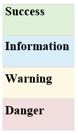

# Bootstrap Notes

- [on GitHub](https://github.com/twbs/bootstrap)  
- BS 3.4
  - [Getting Started](https://getbootstrap.com/docs/3.4/getting-started/) 
  - [Grid](https://getbootstrap.com/docs/3.4/css/#grid)  
  - [Dropdown Menus](https://getbootstrap.com/docs/3.4/javascript/#dropdowns)
- BS 4.6
  - [Introduction](https://getbootstrap.com/docs/4.6/getting-started/introduction/) 
- BS 5.1
  - [Introduction](https://getbootstrap.com/docs/5.1/getting-started/introduction/) 

Using navs for tab panels requires JavaScript tabs plugin
For tabs with tabbable areas, you must use the [tabs JavaScript plugin](https://getbootstrap.com/docs/3.4/javascript/#tabs). The markup will also require additional role and ARIA attributes – see the plugin's [example markup](https://getbootstrap.com/docs/3.4/javascript/#tabs-usage) for further details.

#### Bootstrap Color Schem for Buttons, Containers, Labels & Links

**Note**: Primary color is dark blue. Default is grey.

## Buttons

### Badged
```html
<button class="btn btn-primary" type="button">
  Messages <span class="badge">4</span>
</button>
```

### Drop Down Menu
```html
<button type="button" class="btn btn-default dropdown-toggle" data-toggle="dropdown" aria-haspopup="true" aria-expanded="false">
  Action <span class="caret"></span>
</button>
[DropMenuList]
```

### Drop Up Menu
```html
<button type="button" class="btn btn-default">Dropup</button>
  <button type="button" class="btn btn-default dropdown-toggle" data-toggle="dropdown" aria-haspopup="true" aria-expanded="false">
     <span class="caret"></span>
     <span class="sr-only">Toggle Dropdown</span>
</button>
[DropMenuList]
```

### Group Horizontal
Can be nested.

```html
<div class="btn-group" role="group" aria-label="...">
  <button type="button" class="btn btn-default">Left</button>
  <button type="button" class="btn btn-default">Middle</button>
  <button type="button" class="btn btn-default">Right</button>
</div>
```
**Option Classes**:
Sizing:
•	`btn-group-lg`
•	`btn-group-sm`
•	`btn-group-xs`

Action: 
•	`dropup`

Justified:
•	`btn-group-justified`

### Group Vertical
Can be nested.

```html
<div class="btn-group-vertical" role="group" aria-label="...">
  <button type="button" class="btn btn-default">Top</button>
  <button type="button" class="btn btn-default">Middle</button>
  <button type="button" class="btn btn-default">Bottom</button>
</div>
```

**Option Classes**:
Sizing:
•	`btn-group-lg`
•	`btn-group-sm`
•	`btn-group-xs`

### Inline
```html
<p>
  <a href="#" class="btn btn-primary" role="button">Button1</a>
  <a href="#" class="btn btn-default" role="button">Button2</a>
</p>
```

**Option Classes**:
Color:
•	`btn-primary`
•	`btn-default`
•	`btn-information`
•	`btn-warning`

## Plain
```html
<button type="button" class="btn btn-default btn-lg">
  <span class="[ICONClassName]" aria-hidden="true"></span> [BTNName]
</button>
```

**Option Classes**:
Colors:
•	`btn-danger`
•	`btn-default`
•	`btn-info`
•	`btn-primary`
•	`btn-success`
•	`btn-warning`
Sizing:
•	`btn-lg`
•	`btn-sm`
•	`btn-xs`

### Split 
First is label (not active) and second is caret (active).

```html
<button type="button" class="btn btn-danger">Action</button>
<button type="button" class="btn btn-danger dropdown-toggle" data-toggle="dropdown" aria-haspopup="true" aria-expanded="false">
  <span class="caret"></span>
  <span class="sr-only">Toggle Dropdown</span>
</button>
```

## Containers
Use containers to split the layout into sections where you put your DOM in a box.
```html
<div id="[ContainerName]" class="container">
  [YourHTML]
</div>  <!-- End of [ContainerName] -->
```

### Panels
```html
<div class="panel panel-default">
  <div class="panel-heading">Panel heading</div>
  <div class="panel-body">Panel Body</div>
  <div class="panel-footer">Panel footer</div>
</div>
```
**NOTE**: Text is same color, but darker.

**Option Classes**:
Colors:
•	`panel-danger`
•	`panel-info`
•	`panel-primary`
•	`panel-success`
•	`panel-warning`

### Row-Column
Rows are containers for columns. A row is split into 12 sections and each section can be addressed using appropriate column tags to set the size of each column. Offsets can also be used to separate columns and count as columns for the total number of columns. The totla of the columns and offsets cannot excede 12.

A Simple 2 column row:
```html
<div class="row">
  <div class="col">
  </div>
  <div class="col">
  </div>
</div>
```

A 2 column equally split example with a Small breakpoint:
```html
<div class="row">
  <div class="col-sm-6">
  </div>
  <div class="col-sm-6">
  </div>
</div>
```
A 4 column equally split example with a Medium breakpoint that also breaks for smal into a 2 column double stacked presentation:
```html
<div class="row">
  <div class="col-xs-6 col-md-3">
  </div>
  <div class="col-xs-6 col-md-3">
  </div>
  <div class="col-xs-6 col-md-3">
  </div>
  <div class="col-xs-6 col-md-3">
  </div>
</div>
```
Supporting CSS ( available in bootstrap.css with built-in responsiveness )
```css
.row{
  display: flex;
  flex-wrap: wrap;
  margin-right: -15px;
  margin-left: -15px;
}
.col, .col-auto,
.col-1,.col-2,.col-3,.col-4,
.col-5,.col-6,.col-7,.col-8,
.col-9,.col-10,.col-11,.col-12 {
  position:relative;
  width:100%;
  min-height: 1px;
  padding-right: 15px;
  padding-left: 15px;
}
.col{
  flex-basis:0;
  flex-grow:1;
  max-width:100%
}
.col-auto{
  flex:0 0 auto;
  width:auto;
  max-width:none
}
.col-1{
  flex:0 0 8.333333%;
  max-width:8.333333%
}
.col-2{
  flex:0 0 16.666667%;
  max-width:16.666667%
}
.col-3{
  flex:0 0 25%;
  max-width:25%
}
.col-4{
  flex:0 0 33.333333%;
  max-width:33.333333%
}
.col-5{
  flex:0 0 41.666667%;
  max-width:41.666667%
}
.col-6{
  flex:0 0 50%;
  max-width:50%
}
.col-7{
  flex:0 0 58.333333%;
  max-width:58.333333%
}
.col-8{
  flex:0 0 66.666667%;
  max-width:66.666667%
}
.col-9{
  flex:0 0 75%;
  max-width:75%
}
.col-10{
  flex:0 0 83.333333%;
  max-width:83.333333%
}
.col-11{
  flex:0 0 91.666667%;
  max-width:91.666667%
}
.col-12{
  flex:0 0 100%;
  max-width:100%
}
```

### Well
A well controls padding and rounded corners.
```html
<div class="well">...</div>
```

**Option Classes**:
Sizes:
•	`well-sm`
•	`well-lg`

## Header 

### Jumbotron
You can create special headers with subdued subheaders with jumbotron.
```html
<div class="jumbotron">
  <div class="container">
    ...
  </div>
</div>
```

## Labels
```html
<h3>Example heading <span class="label label-default">New</span></h3>
```

**Option Classes**:
Colors:
•	`label-danger`
•	`label-info`
•	`label-primary`
•	`label-success`
•	`label-warning`

## Links (AKA: Anchors)
```html
<a href="#" class="list-group-item">Link</a>
```

### Alerts
```html
```
<div class="alert [Color]" role="alert">
  <a href="#" class="alert-link">...</a>
</div>

**Option Classes**:
Colors:
•	`alert-info`
•	`alert-warning`
•	`alert-danger`
•	`alert-success`

### Disabled Link
```html
<a href="#" class="list-group-item disabled">Link</a>
```

## Links

### Dismissable Link
Be sure to use the <button> element with the data-dismiss="alert" data attribute. Requires [JS plugin](https://getbootstrap.com/docs/3.4/javascript/#alerts).
```html
<div class="alert alert-warning alert-dismissible" role="alert">
  <button type="button" class="close" data-dismiss="alert" aria-label="Close"><span aria-hidden="true">&times;</span></button>
  <strong>Warning!</strong> Better check your PPE.
</div>
```

## Lists

### List Group
```html
<ul class="list-group">
  <li class="list-group-item">List Item 1</li>
  <li class="list-group-item">List Item 2</li>
  <li class="list-group-item">List Item 3</li>...
</ul>

```

### List Item
```html
<li>
  <a href="#">[LinkName]</a>
</li>
```

### List Item, Badged
```html
<li>
  <a href="#">Messages
    <span class="badge">3</span>
  </a>
</li>
```

### Breadcrumb List
Separators are automatically added in CSS through `:before` and `content="[Separator]"`.
```html
<ol class="breadcrumb">
  <li><a href="#">Home</a></li>
  <li><a href="#">Library</a></li>
  <li class="active">Data</li>
</ol>
```

### Button List
```html
<div class="btn-toolbar" role="toolbar">
  <div class="btn-group">
    [ButtonList]…
  </div>
</div>
```
Alternate:
```html
<div class="list-group">
  <button type="button" class="list-group-item">Cras justo odio</button>
  <button type="button" class="list-group-item">Dapibus ac facilisis in</button>
  <button type="button" class="list-group-item">Morbi leo risus</button>
  <button type="button" class="list-group-item">Porta ac consectetur ac</button>
  <button type="button" class="list-group-item">Vestibulum at eros</button>
</div>
```

### Images or Thumbnails
Thumbnails are designed to showcase linked images with minimal required markup.
```html
<div class="row">
  <div class="col-xs-6 col-md-3">
    <a href="#" class="thumbnail">
      
    </a>
  </div>
  ...
</div>
```

### Linked
```html
<div class="list-group">
  <a href="#" class="list-group-item active">Link 1</a>
  <a href="#" class="list-group-item">Link2</a>
  <a href="#" class="list-group-item">Link3</a>
</div>
```
**Option Classes**:
•	`active` - highlights active link 

### Media
```html
<div class="media">
  <div class="media-left media-middle ">
    <a href="#">
      
    </a>
  </div>
  <div class="media-body">
    <h4 class="media-heading">Media heading</h4>
    ...
  </div>
</div>
```
**Option Classes**:
Horizontal Align:
•	`media-left` - Left of block aligned media
•	`media-right` - Right of block aligned media
Vertical Align:
•	`media-bottom` -` Bottom of block 
•	`media-middle` - Middle of block 
•	`media-top` - Top of block [default]

Alternate:
```html
<ul class="media-list">
  <li class="media">
    <div class="media-left">
      <a href="#">
        
      </a>
    </div>
    <div class="media-body">
      <h4 class="media-heading">Media heading</h4>
      ...
    </div>
  </li>
</ul>
```

### Navigation Pills
```html
<ul class="nav nav-pills">
  <li role="presentation" class="active"><a href="#">Home</a></li>
  <li role="presentation"><a href="#">Profile</a></li>
  <li role="presentation"><a href="#">Messages</a></li>
</ul>
```
**Option Classes**:
•	`nav-stacked`
•	`nav-justified`
•	`disabled`

### Navigation Tabs
```html
<ul class="nav nav-tabs">
  <li role="presentation" class="active"><a href="#">Home</a></li>
  <li role="presentation"><a href="#">Profile</a></li>
  <li role="presentation"><a href="#">Messages</a></li>
</ul>
```
**Option Classes**:
•	`nav-stacked`
•	`nav-justified`
•	`disabled`

## Menus

### Dropdown Menu Container
This menu is made interactive with the dropdown [JavaScript plugin](https://getbootstrap.com/docs/3.4/javascript/#dropdowns).
```html
<div class="dropdown">
  <button class="btn btn-default dropdown-toggle" type="button" id="dropdownMenu1" data-toggle="dropdown" aria-haspopup="true" aria-expanded="true">
    [DropdownMenuLabel] <span class="caret"></span>
  </button>
  [DropMenuItemsList]
</div>
```
**Option Classes**:
•	`disabled`

### Dropup Menu Container
This menu is made interactive with the dropdown [JavaScript plugin](https://getbootstrap.com/docs/3.4/javascript/#dropdowns).
```html
<div class="dropup">
  <button class="btn btn-default dropdown-toggle" type="button" id="dropdownMenu2" data-toggle="dropdown" aria-haspopup="true" aria-expanded="false">
    [DropupMenuLabel] <span class="caret"></span>
  </button>
  [DropMenuItemsList]
</div>
```
**Option Classes**:
•	`disabled`

### Drop Menu Item List
```html
<ul class="dropdown-menu">
  <li><a href="#">Action</a></li>
  <li><a href="#">Another action</a></li>
  <li><a href="#">Something else here</a></li>
</ul>
```
**Option Classes**:
•	`dropdown-menu-right`

#### List Item Dividers & Headers
Use these to segment the list into sections. Add headers for more seperation.
```html
<li role="separator" class="divider"></li>
<li class="dropdown-header">Dropdown Menu List Segment Header</li>
```

### Navigation Menu
```html
<header class="navbar navbar-static-top" id="top">
  <div class="container">
    <div class="navbar-header">
      <button class="navbar-toggle collapsed" type="button" data-toggle="collapse" data-target="#pagenavbar" aria-controls="bs-navbar" aria-expanded="false">
        <span class="sr-only">Toggle navigation</span>
      </button>
      <h3>PageName</h3>
    </div>
    <nav id="pagenavbar" class="collapse navbar-collapse">
      <ul class="nav navbar-nav">
        <li>Left Side Menu</li>
      </ul>
      <ul class="nav navbar-nav navbar-right">
        <li>Right Side Menu</li>
      </ul>
    </nav>
  </div>
</header>
```

## Progress Bars
```html
<div class="progress">
  <div class="progress-bar" role="progressbar" aria-valuenow="60" aria-valuemin="0" aria-valuemax="100" style="width: 60%;">
    <span class="sr-only">60% Complete</span>
  </div>
</div>
```
With embedded label:
```html
<div class="progress">
  <div class="progress-bar" role="progressbar" aria-valuenow="60" aria-valuemin="0" aria-valuemax="100" style="width: 60%;">
    60%
  </div>
</div>
```
**Option Classes**:
Colors:
•	`progress-bar-success`
•	`progress-bar-info`
•	`progress-bar-warning`
•	`progress-bar-danger`
Striped:
•	`progress-bar-striped`
Animated:
•	`active`

### Stacked
```html
<div class="progress">
  <div class="progress-bar progress-bar-success" style="width: 35%">
    <span class="sr-only">35% Complete (success)</span>
  </div>
  <div class="progress-bar progress-bar-warning progress-bar-striped" style="width: 20%">
    <span class="sr-only">20% Complete (warning)</span>
  </div>
  <div class="progress-bar progress-bar-danger" style="width: 10%">
    <span class="sr-only">10% Complete (danger)</span>
  </div>
</div>
```

