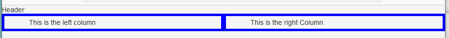

# Columns

## A Simple Example
These are the classes
- **column-container** – use as an outer container	
    ```html
    <DIV class="container">   </DIV>
    ```
- **column-of-two** – use to have two equally spaced columns in the area	
    ```html
    <DIV class="column-of-two">   </DIV>
    <DIV class="column-of-two">   </DIV>
    ```
- **column-of-three** – use to have three equally spaced columns in the area	
    ```html
    <DIV class="column-of-three">  </DIV>
    <DIV class="column-of-three">  </DIV>
    <DIV class="column-of-three">  </DIV>
    ```
- **column-of-four** – use to have four equally spaced columns in the area
    ```html
    <DIV class="column-of-four">   </DIV>
    <DIV class="column-of-four">   </DIV>
    <DIV class="column-of-four">   </DIV>
    <DIV class="column-of-four">   </DIV>
    ```
**Note**: All columns must be placed within a *column-container*.  The *column-container* allows the columns to scale properly themselves without being affected by other content on a page.

The Stylesheet:
```css
/* Begin Column Classes */
.column-container:after {
  display: block;
  height: 0;
  clear: both;
  content: " ";
}
.column-of-two {
    padding: 0.5%;
  float: left;
  width: 50%;
}
.column-of-three {
    padding: 0.5%;
  float: left;
  width:33%;
}
.column-of-four {
    padding: 0.5%;
  float: left;
  width: 25%;
}
```

The usage:
```html
<div class="column-container">
<!- Header – above the two columns
  <div class="centered section-header">
    Header
  </div>
  <div class="column-of-two centered" style="padding-right: 50px; padding-left: 50px; border:solid 5px blue” >
    This is the left column 
  </div>
  <div class="column-of-two centered" style="padding-right: 50px; padding-left: 50px; border:solid 5px blue">
    This is the right Column
  </div>
</div> <!—End Column Container -->
```

The Result:  

**Note**: I used wide blue border for showing the actual columns. 

## Another Method:
```css
/* Columns */
.col,.half,.third,.twothird,.threequarter,.quarter{float:left;width:100%}

/* Small columns */
@media (min-width:480px){
  .col.s1 {width:8.33333%}
  .col.s2 {width:16.66666%}
  .col.s3 {width:24.99999%}
  .col.s4 {width:33.33333%}
  .col.s5 {width:41.66666%}
  .col.s6 {width:49.99999%}
  .col.s7 {width:58.33333%}
  .col.s8 {width:66.66666%}
  .col.s9 {width:74.99999%}
  .col.s10 {width:83.33333%}
  .col.s11 {width:91.66666%}
  .col.s12 {width:99.99999%}
}

/* Medium columns */
@media (min-width:768px){
  .col.m1 {width:8.33333%}
  .col.m2 {width:16.66666%}
  .col.m3 {width:24.99999%}
  .col.m4 {width:33.33333%}
  .col.m5 {width:41.66666%}
  .col.m6 {width:49.99999%}
  .col.m7 {width:58.33333%}
  .col.m8 {width:66.66666%}
  .col.m9 {width:74.99999%}
  .col.m10 {width:83.33333%}
  .col.m11 {width:91.66666%}
  .col.m12 {width:99.99999%}
}

/* Large columns */
@media (min-width:1200px){
  .col.l1 {width:8.33333%}
  .col.l2 {width:16.66666%}
  .col.l3 {width:24.99999%}
  .col.l4 {width:33.33333%}
  .col.l5 {width:41.66666%}
  .col.l6 {width:49.99999%}
  .col.l7 {width:58.33333%}
  .col.l8 {width:66.66666%}
  .col.l9 {width:74.99999%}
  .col.l10 {width:83.33333%}
  .col.l11 {width:91.66666%}
  .col.l12 {width:99.99999%}
}
```

