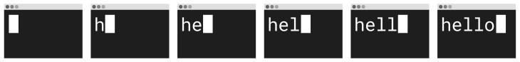

# CSS Image Sprites

- https://developer.mozilla.org/en-US/docs/Web/CSS/CSS_Images/Implementing_image_sprites_in_CSS  
- https://www.udacity.com/blog/2021/07/an-easy-guide-to-css-sprites.html  


Addressing the 3 Sprites of the image:
```css
/* Define the Images */
#home {
  width: 46px;  
  height: 44px;  
  background: url(img_navsprites.gif) 0 0;  
}  
#previous {
  width: 43px;
  height: 44px;
  background: url(img_navsprites.gif) -47px 0;
}
#next {
  width: 43px;
  height: 44px;
  background: url(img_navsprites.gif) -91px 0;
}

/* Add Hover Changes over the Buttons */
#home a:hover {
  background: url('img_navsprites_hover.gif') 0 -45px;
}
#prev a:hover {
  background: url('img_navsprites_hover.gif') -47px -45px;
}
#next a:hover {
  background: url('img_navsprites_hover.gif') -91px -45px;
}
```

Example explained:
- `` - Only defines a small transparent image because the src attribute cannot be empty. The displayed image will be the background image we specify in CSS.
- `width: 46px; height: 44px`; - Defines the portion of the image we want to use
- `background: url(img_navsprites.gif) 0 0;` - Defines the background image and its position (left 0px, top 0px)
- `#home a:hover {background: url('img_navsprites_hover.gif') 0 -45px;}` - For all three hover images we specify the same background position, only 45px further down

Calling these Sprites:
```html
  
  
  
```

## Flags Example

  

```css
.flags-canada, .flags-mexico, .flags-usa {
  background-image: url('../images/flags.png');
  background-repeat: no-repeat;
}
.flags-canada {
  height: 128px;
  background-position: -5px -5px;
}
.flags-usa {
  height: 135px;
  background-position: -5px -143px;
}
.flags-mexico {
  height: 147px;
  background-position: -5px -288px;
}
```

## Animation with Sprites



```css
.terminal {
  height: 1024px;
  width: 1440px;
  background: url("hello.png");
  animation-name: sprite; 
  animation-duration: 1.5s;
  animation-timing-function: steps(6);
  animation-iteration-count: infinite;
  /* Short Animation form:
  animation: sprite 1.5s steps(6) infinite; */
  transform: translate(-25%, -25%) scale(0.5);
}
@keyframes sprite {
  from { background-position: 0px; }
  to { background-position: -8640px; }
  /* Same as above, only in short form
  to { background-position: -8640px; } */
}
@media only screen and (min-width: 1024px) {
  .terminal {
    transform: scale(1);
  }
}
```
```html
<div class="terminal"></div>
```

## Creating Your Own Sprites

**Generate Sprites with Grunt / Gulp / Node**

If you’re using Grunt, Gulp, or Node in general, css-sprite (now called [sprity](https://www.npmjs.com/package/sprity)) is a wonderful node package that creates sprites from a glob of images. Sprity has a lot of great features including formatting output as PNG, JPG (or [Data URIs](https://css-tricks.com/data-uris/) of those), and stylesheet generation in CSS, LESS, Sass, and Stylus.

To compile sprites via command line, install css-sprite globally with:
```bash
$ npm install sprity -g  
```
Then, to generate sprites and the corresponding stylesheet, run:
```bash
$ sprity ./output-directory/ ./input-directory/*.png  
```
For more information on using css-sprite with Grunt or Gulp (or many other environments), head over to the [project’s repository on GitHub](https://github.com/sprity/sprity).

**Generate Sprites with Compass**

[Generating sprites with Compass](http://compass-style.org/help/tutorials/spriting/) takes some additional setup and maintenance, but if you’re already using Compass, it fits in well with your existing workflow.

Start by creating a directory within your `images` directory (yes, it does need to be inside your `images` directory to work) with a name that corresponds to the sprites you’d like to create. Ensure that the images you’re converting to sprites are PNGs and place them in your new directory. I’m creating flag sprites, so I’ve named my directory flags and placed three PNGs in the directory.

In a new SCSS file that I’ve called `flags.scss` (the name here is not important), the following three lines will, in order, import Compass’ sprite making tools, glob import the PNGs to be converted to sprites (notice that the path here does not include images/), and then generate the CSS for the sprites. Be mindful that the @include statement’s middle word needs to match the directory in the line before it.
```css
@import "compass/utilities/sprites";  
@import "flags/*.png";  
@include all-flags-sprites;  
```
This is a fairly simple process for generating sprites, but it has a few drawbacks/oddities:

  - The generated CSS does not include widths or heights for the sprites.
  - There is no shared class between the sprites; the background-image is applied to each class.

**Generating Sprites with ImageMagick**

[ImageMagick](https://www.imagemagick.org/) can be used to create a spritesheet from the command line with the following commands:
```
convert *.png -append sprites.png # append vertically
convert *.png +append sprites.png # append horizontally
```
This will take all the PNG files selected by the glob and concatenate them into a single file, but will not create the corresponding stylesheet. If you use ImageMagick to create your sprites, you may want to read the section below on using Sprite Cow.

**Using Sprite Cow with your Sprites**

[Sprite Cow](http://www.spritecow.com/) is a hosted tool for generating a stylesheet corresponding to your sprites. It doesn’t make the sprite for you, it just helps you get numbers you need to use the sprite (the width, height, and background-position of individual parts of the sprite). It boasts 2x image compatibility and a simple interface for quickly designating which areas of the sprite make up each image to create CSS for. You just click the part you need and it gives you the CSS you need.

**Generate Sprites with Spritepad**

[Spritepad](http://wearekiss.com/spritepad) is another hosted solution for creating sprites. With Spritepad, you upload individual images, position them however you’d like, and the CSS is updated in real time. When you’re done, download the image and copy the CSS over to your project.  

**Generate Sprites with SpriteMe**

[SpriteMe](http://spriteme.org/) is a bookmarklet that generates a sprite based on what it finds on the current page. So essentially you’d develop without using sprites at all, then use this to sprite things together at the end. [Here’s a workflow explaining how that would work.](https://css-tricks.com/css-sprites-workflow/)  

**Should my sprites be horizontal or vertical?**

One option is neither. Compact them into a grid, making the smallest size, dimensionally that you can. The dimensional size of an image plays a role in how much memory the image will take up when being used, so the less the better. If you end up laying out your own sprite, Sprite Cow is a good tool to help with the CSS generation part.

If, for simplicity, you’re going to pick one or the other, one way to do that is to look at the largest width and the largest height of your image files. If the largest width is greater than the largest height, the sprite sheet should be arranged horizontally. If the largest height is greater than the largest width, vertically. If you’re using a generation tool, they will generally make this choice for you.

In some situations, it may actually make sense to [lay out a sprite diagonally](http://www.aaronbarker.net/2010/07/diagonal-sprites/). This can make it possible to use a sprite in an area of unknown width and height, which is pretty cool.

Although another possible way to get around that is [using a pseudo element](https://css-tricks.com/pseudo-spriting/). 

