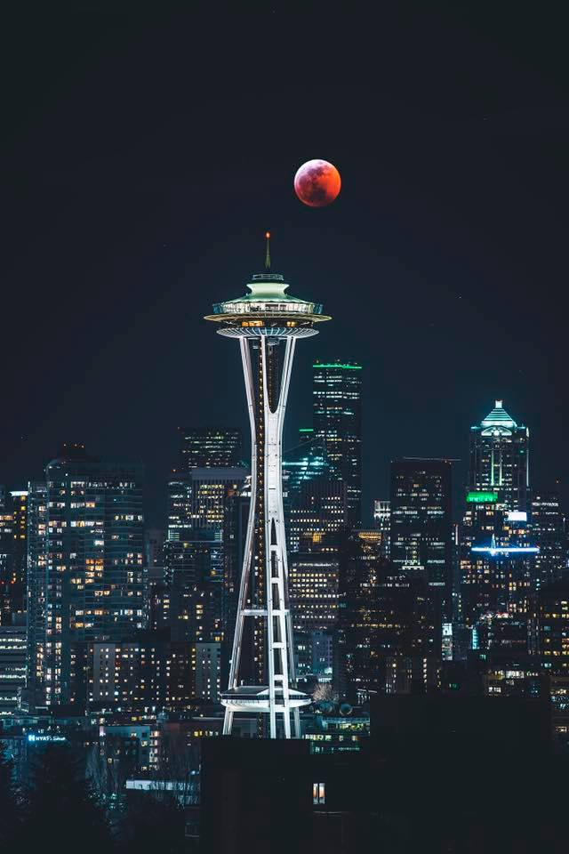
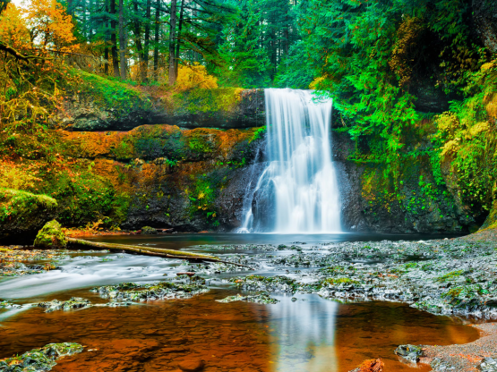
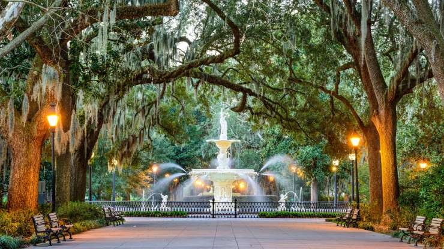

# Travel

### Cahokia Mounds, Mississippi
Just a few miles outside St. Louis are a series of earthen mounds, the last remnants of one of the greatest cities in the world. Settled around the year 600, Cahokia once housed an estimated 10,000 to 20,000 people in six square miles—the city was larger than London in 1250. https://cahokiamounds.org/

### Meadowcroft Rockshelter, PA
In the hills of Pennsylvania is the site of the oldest human habitation in North America. The Meadowcroft Rockshelter is thought to have been a campsite as early as 16,000 years ago. https://heinzhistorycenter.org/

### Great Serpent Mound, OH
Though farming has largely destroyed many examples, raised-earth effigies once dotted the landscape of the Midwest. One of the largest is the Great Serpent Mound in Ohio, which is 1,300 feet long. Archaeologists believe it was built between 1000 B.C. and 1200 A.D. https://ohiohistory.org/

### Silver Falls State Park, OR
Silver Falls State Park in Silverton, Oregon, boasts 10 picturesque waterfalls worth exploring. A loop to visit all 10 waterfalls is 6.9 miles long, per https://Oregon.com. 

### Poverty Point, Louisiana
Like Cahokia, Poverty Point is a collection of mounds and ridges that once formed an ancient city, whose construction began around 1500 B.C. The formations were thought to be natural until aerial surveys in the 1950s proved otherwise. https://povertypoint.us/

# Kitsap County

### Anderson Landing - Trail Maintenance and Invasive Removal
Anderson Landing Preserve, Anderson Hill Rd Silverdale, WA 98383
Come explore Anderson Landing Preserve. Located conveniently in Central Kitsap County. Anderson Landing Preserve has a variety of ecosystems in its 66 Acres. From forests, to wetlands, to beach along the Hood Canal. Anderson Landing is a great place to experience what Kitsap County has to offer. 

### Banner Forest – Trail Structure Construction
Banner Forest Heritage Park, ​Banner Road SE & SE Overra Rd Port Orchard, WA 98367
Banner forest is a beautiful parcel of forested land in the south end of the county. Stewards have scouted a project that will make the trail system more sustainable!

### Hansville Greenway 
Hansville Greenway, NE Buck Lake Rd Hansville, WA 98340
Hansville Greenway and Wildlife Corridor is located in the Northern most section of Kitsap County. The primary goal of the Hansville Greenway is to enhance wildlife habitat, while providing compatible, passive recreation opportunities. 

### Howe Farm – Orchard Renovation and Trail Maintenance
Howe Farm, Long Lake Rd SE Port Orchard, WA 98366 
A chance to explore this beautiful, pastoral park property that is home to an off-leash dog park, an apple orchard, open space land, and an old heritage barn. 

### Whispering Firs Stormwater Park
12300 Silverdale Way, north of the Signature Apartments
This stunning new park captures runoff, removes pollutants, and manages storm flows through a series of ponds and treatment cells.  Inside the cells, special soils and native plants remove pollutants like oils, metals, and bacteria from runoff before sending it to holding ponds, which slowly release cleaner water downstream to Clear Creek.  This innovative project is the latest in a series of projects in the Clear Creek watershed designed to reduce flooding, improve water quality, and restore habitat around Clear Creek and Dyes Inlet.
The park is currently open for public use.  Visitors are encouraged to take advantage of the many public amenities surrounding this facility. Walk the paths around the ponds and landscape features, with their concentric ripples reminiscent of the visual rhythms of water drops in a still pool.  Take in the view of the Olympics, picnic amongst the trees, or learn about the many ways this park is working to improve water quality in Puget Sound.
Kitsap County Public Works completed the project in June 2019 with an extensive native planting palette provided by the Kitsap Conservation District. The project was designed by N.L. Olson and Associates and Parametrix; and funded by Kitsap County Public Works – Stormwater in partnership with the Department of Ecology who provided $1.5 million in funding towards the $2.5 million project.

# Savannah, GA

