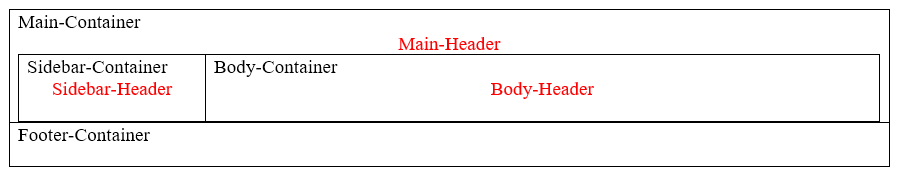

# Containers & Wrappers  

**Containers** are major sections within the BODY of the document.  Thee are used to segment the page and separate by function on the page.   

**Wrappers** are to hold the data to be displayed. Divisions provide upper level formating, paragraphs contain the information, and the SPAN is to modify small segments of text within a paragraph. 


### Container & Section Elements
| Element|Notes|Roadmap |  
| --- | --- | --- |  
| Division|class="column-container" <BR> class="column-of-two" <BR> class="column-of-three"|<DIV class="<Class>" id="<IDName>">  </DIV> |  
| Article|Container|`<ARTICLE>…</ARTICLE>` |  
| Header|Container|`<HEADER>…</HEADER>` |  
| Aside|Container|`<ASIDE>…</ASIDE>` |  
| Section|Container|`<SECTION>…</SECTION>` |  
| ContentContainer||`<CONTENT>…</CONTENT>` |  
| Footer|Container|`<FOOTER>…</FOOTER>` |  
| Navigation|Container|`<NAV>  </NAV>` |  
| Division| Wrapper | `<DIV>  </DIV>` |  
| Paragraph|class="centered"|`<P class="<Class>" id="<IDName>">  </P>` |  
| Span|Wrapper: Used for small area style changes or identification of an area in the document. |`<SPAN class="<Class>" id="<IDName>"></SPAN>` |  

***PLACE DIV-P-SPAN GRAPHIC HERE!***

#### Make a Custom Container or Wrapper
'''html
<DIV class="ContainerName">
</DIV>
<DIV class="WrapperName">
</DIV>
```

## Article  
```html
<ARTICLE id="" class="">…</ARTICLE>
```

## Aside  
```html
<ASIDE id="" >…</ASIDE>
```

## Div  (Division)  
```html
<DIV id="" class=""></DIV>
```

```html
<div class="small center">
  <p> </p>
  <p> </p>
</div>
```

## Footer  
```html
<FOOTER id="" class="">…</FOOTER>
```

## Header  
```html
<HEADER id="" class="">…</HEADER>
```

## Main  
```html
<MAIN role="main" id="" class="">…</MAIN>
```

## Nav  
```html
<NAV id="" class=""></NAV>
```

## P (Paragraph)  
```html
<DIV id="" class=""></DIV>
```

## Section  
```html
<SECTION id="" class="">…</SECTION>
```

## Span  
```html
<SPAN id="" class=""></SPAN>
```

# Examples

### Use a Wrapper to store & hide variables
```javascript
<div id="storeStartTime" class="hidden"></div>
<p id="storeAnythingAtAll" class="hidden">3</p>
<p id="storeExercises" class="hidden">4,5,6,7,8,9,10,11,12,13,14,15,16,17,18,19</p>
<p id="storeFastestTime" class="hidden"></p>
<p id="storeAnything" class="hidden"></p>
<p id="storeAnythingElse" class="hidden"></p>
<p id="storeRegEx" class="hidden"></p>
<p id="timerStarted" class="hidden"></p>
<p id="timerMultiple" class="hidden">1</p>
<p id="testMode" class="hidden">0</p>
```

## Accessibility (ARIA Support)
| Action | HTML | CSS |  
| --- | --- | --- |  
| Bread Crumbs | `<div id="breadcrumb-container">` <BR> `<ol id="breadcrumbs" aria-label="Breadcrumbs"></ol>` <BR> `</div>` | `#breadcrumb-container {` <BR> `}` <BR> `#breadcrumbs {` <BR> `}` |  

## Box System fot Simple Web Page 

  

| Action | HTML | CSS |  
| --- | --- | --- |  
| Body-Container | `<div id="body-container"></div> <!-- \#body-container -->` | `#body-container {` <BR> `}` |  
| Body-Header | `<div id="body-header">` <BR> `  <h1 id="body-header-text"></h1>` <BR> `</div> <!-- \#body-header -->` | `#body-header {` <BR> `}` |  
| Footer-Container | `<div id="footer-container role="contentinfo">` <BR> `  <section class="footer-body">` <BR> `</section>` <BR> `</div> <!-- \#footer-container -->` | `#footer-container {` <BR> `}` |  
| Main-Container | `<div id="main-container"></div> <!-- \#main-container -->` | `#main-container {` <BR> `}` |  
| Main-Header | `<div id="main-header">` <BR> `  <h1 id="main-header-text"></h1>` <BR> `</div> <!-- \#main-header -->` | `#main-header {` <BR> `}` |  
| Sidebar Container | `<div id="sidebar-container"></div> <!-- \#sidebar-container -->` | `#sidebar-container {` <BR> `}` |  
| Sidebar-Header | `<div id="sidebar-header">` <BR> `  <h1 id="sidebar-header-text"></h1>` <BR> `</div> <!-- \#sidebar-header -->` | ``#sidebar-header {` <BR> `}`` |  

## Modify Text
| Action | HTML | CSS |  
| --- | --- | --- |  
| Small | `<span class="smalltext"></span>` | `.smalltext {` <BR> `  font-size=0.5;` <BR> `}` |  
| Small Caps | `<span class="smallcap"></span>` | `.smallcap{` <BR> `  font-size=0.5;` <BR> `  text-transform="uppercase";` <BR> `}` |  

