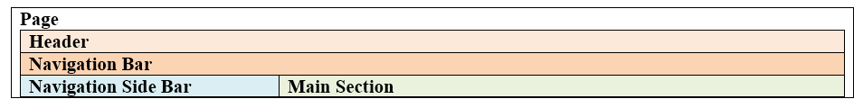
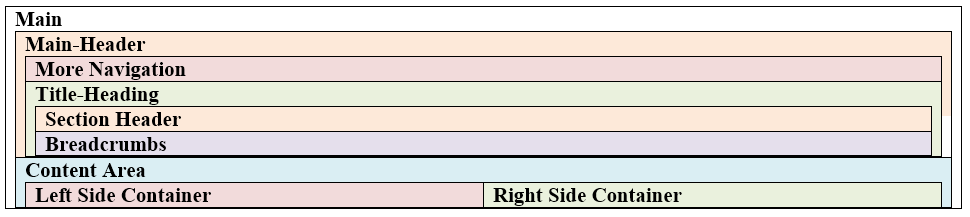

# Page Layout

#### Clear (Before & After!)
```html
<div class="clear"></div>
```
```css
.clear, .clear:before, .clear:after {
  clear: both; 
}
```

#### Display a Background Image with Content
```html
<div class="bg-image"> 
  [Any content over the image goes here.]
</div>
```
```css
.bg-image { 
  background-image:url([ImageURL]);
}
```

#### Page Header
```html
<div class="container pagetitle">
  <div class="row">
  <div class="col-lg-12">
    <h1 class="pageTitle" style="height: 0px;">Page title</h1>
  </div>
  </div>
</div> <!-- End Title Area -->
```
```css
.pagetitle{
  /*padding-bottom: 50px;*/
}
```

#### Secondary Container
Contains a Navigation Menu in a left side bar
```html
<div class="ia-secondary-container tipsy-enabled" data-tree-type="page-tree">
</div> <!-- End of ia-secondary-container -->
```

#### Space Bar (SharePoint)
This is a Side Bar Popup Navigation Menu using a button at bottom of the sidebar, it contains a Navigation Menu. 
```html
<div class="space-tools-section">
</div>  <!-- End of Space Tools Menu -->
```

#### Stage
```html
<div class="stage" >
  <div class="stage_box">
    <h4>Stage Box Title 1</h4>
    <a href="#" target="_blank">Stage box 1 link »</a> 
  </div>
  <div class="stage_box">
    <h4>Stage Box Title 2</h4>
    <a href="#" target="_blank">Stage box 2 link »</a> 
  </div>
</div>
```
```css
.stage {
  Background-color: rgb(0, 56, 107); /* navy blue */
  display: flex;
}
.stage_box {
  border: solid 1px #fff;
  height: 70px;
  background-color: rgb(0,69, 122);
  margin: 5px;
  padding: 10px;
  width: 200px;
}
.stage_box h4{
  margin-top: 5px;
  color: #fff;
}
.stage_box a{
  text-align: right;
  display: block;
  color:rgb(255, 184, 88);
  font-size: 15px;
}
```

#### Thumbnail Image
```html
<div class="thumbnail">
  
  <div class="caption">Go here: <a href="#">Link Title</a></div>
</div>
```
```css
.thumbnail {
  background-color: rgb(0, 56, 107);   /* Navy Blue */
/*  background-color: rgb(255, 184, 88); Yellow-Orange */
  border: none;
}
.thumbnail img {
  border: none;
  height: 230px;
  width: 184px; 
}
.thumbnail .caption {
  color: #fff;
  text-align: center;
}
.thumbnail .caption a {
  color: rgb(255, 184, 88);
}
```

## Page & Full Height Container
This is the primary container for the page. It can include any number of Page Components such as:
  - Banner/Header
  - Navigation Menu (Bar or Side Menu)
  - Main Content
  - Status Bar  
  - Footer  
 
 
 
```html
<div id="page">
  <div id="full-height-container">
    [Content Goes Here!]
  </div>  <!—End of full-height-container -->
</div>  <!—End of page -->
```

## Breadcrumbs
```html
<div id="breadcrumb-section"> </div>
```

## Columns, Two
Left Side:
```html
<div id="Left-sidebar-container" style="background-color:#e0e0ff;width:75%;padding: 0 0 0 5px;">
  <h4>Left Side Container</h4>
</div><!-- End of sidebar-container -->
```
Right Side:
```html
<div id="Right-sidebar-container" style="background-color:#e0ffe0;width:25%;padding: 0 0 0 5px;">
  <h4>Right Side Container</h4>
</div><!-- End of sidebar-container -->
```

## Content Section
```html
<div id ="content-area" class="container" style="display:flex;width:100%;border:solid;border-size:2px;border-color:black;">
    [Content HTML goes here.]
</div> <!-- End of Content Area -->
```

## Footer
This example requires bootstrap for row/column.
```html
<footer class="stickyfooter">      
  <div class="row">
    <div class="col-md-4">Footer Left</div>
    <div class="col-md-4">Footer Center</div>
    <div class="col-md-4">Footer Right</div>
  </div>      
</footer> <!-- End Footer -->
```
```css
footer {
  background-color: #d0ffff;
  border: solid 1px #000;
  color: #000; 
  margin: 0;
}
.stickyfooter {
  bottom: 0;
}
```

## Header
```html
<header id="header" role="banner" class=""> 
  [Header Content]
</header>
```

## Navigation Bar, Main Content Additional Menu, & Side Menu
Controls to collapse or expand menu items.

#### Additional menu:
```html
<div id="MoreNavigation" class="content-navigation view">
  [Drop down menu goes here!]
</div>  <!-- End of MoreNavigation -->
```

#### Drop Menu

#### Side Menu

## Main Content Section
This is the main content of the web page. It can contain any valid HTML. Typical items include:
  - Page Header
  - Breadcrumbs
  - Additional Navigation (to support the page)
  - Sections of Content  



```html
<main role="main" id="main" class="mainContent" style="margin-left: 285px;">
  [Content goes here!]
</main> <!-- \#main -->
```

## Page/Section Header
```html
<div id="main-header">
  <h1>Main Header</h1>
</div>  <!-- End of main-header -->

<div id="title-heading" class="pagetitle" style="background-color: #ffe0e0;">
  <h1>Page Header</h1>
</div>  <!-- End of Title Heading -->

<h2>Section Header</h2>
```


