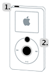

# iPod

##  Unfreeze or reset an iPod Classic

1. Toggle the Hold on and off. (Slide it to Hold, then turn it off again.)

2. Now press and hold the Menu and Select buttons until the Apple logo appears, which may take about 6 to 10 seconds. You may need to repeat this step.

**Notes**:
    If you are having problems resetting the iPod, go ahead and set it on a flat surface. Then make sure the finger pressing the Select button is not touching any part of the click wheel. Also be sure that you are pressing the Menu button towards the outside of the click wheel, not near the center.
    If the above mentioned steps do not work, then you can try connecting your iPod to a power adapter and plug the power adapter into an electrical outlet, or connect the iPod to . Make sure the computer is turned on and isn’t set to go to sleep.

